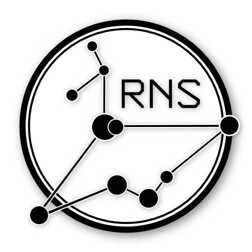

  
<h3>
Перевод официальной документации проекта <a href="https://reticulum.network">Reticulum</a> на русский язык.
</h3>

<h4>
<q>Проект Reticulum — создает новый интернет, отдавая контроль над коммуникациями людям, а не корпорациям или власти.
Присоединяйтесь к великому событию. Создавайте открытый мир с нами.</q>
</h4>

Сайт оформлен в виде HTML страниц с относительными ссылками, чтобы любой мог открыть его локально на своем компьютере.

В коде присутствуют прямые ссылки на документацию проекта. 
Они будут заменены по мере перевода всех глав проекта.

    Добавлен машинный перевод в формате pdf:
    <a href="https://github.com/DerErde/Reticulum-manual-ru/tree/master/reticulum-html/manual" target="_blank" rel="noopener">/manual/</a>

Это именно перевод официальной документации.

Подробная инструкция по выбору оборудования, установке приложения, настройке и т.д. будет сделана в отдельном проекте.

    Альтернативная документация Reticulum:
    <a href="https://kirillz.github.io/reticulum-docs/" target="_blank" rel="noopener">kirillz.github.io/reticulum-docs</a>

    Эта документация:
    <a href="https://dererde.github.io/Reticulum-manual-ru/" target="_blank" rel="noopener">DerErde.github.io/Reticulum-manual-ru</a>

    Этот проект:
    <a href="https://github.com/DerErde/Reticulum-manual-ru" target="_blank" rel="noopener">GitHub/Reticulum-manual-ru</a>

    
Copyright &#169; 2025 — 2026, Mark Qvist

